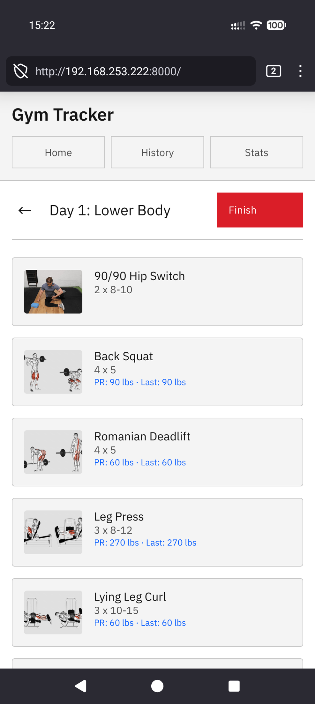
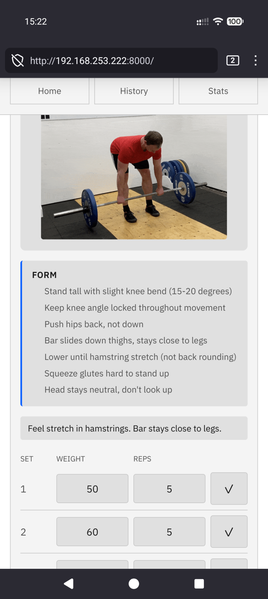
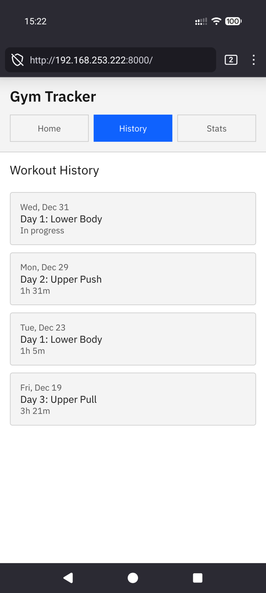
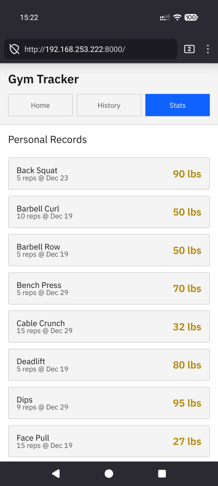

# Gym App

A personal workout tracker for a 3-day Upper/Lower Push-Pull powerbuilding program with integrated mobility work.

## Setup

```bash
python -m venv venv
source venv/bin/activate
pip install -r app/requirements.txt
```

## Run

```bash
cd app
uvicorn main:app --reload
```

Open http://localhost:8000

## Structure

- **Day 1**: Lower Body (mobility + squats, RDL, leg press, etc.)
- **Day 2**: Upper Push (mobility + bench, OHP, dips, etc.)
- **Day 3**: Upper Pull (mobility + deadlift, rows, pullups, etc.)

## Features

- Exercise demonstrations (GIFs)
- Set/rep/weight logging
- PR tracking
- Mobility exercises with duration-based tracking

## Screenshots

<p align="center">
  
  
  
  
</p>
